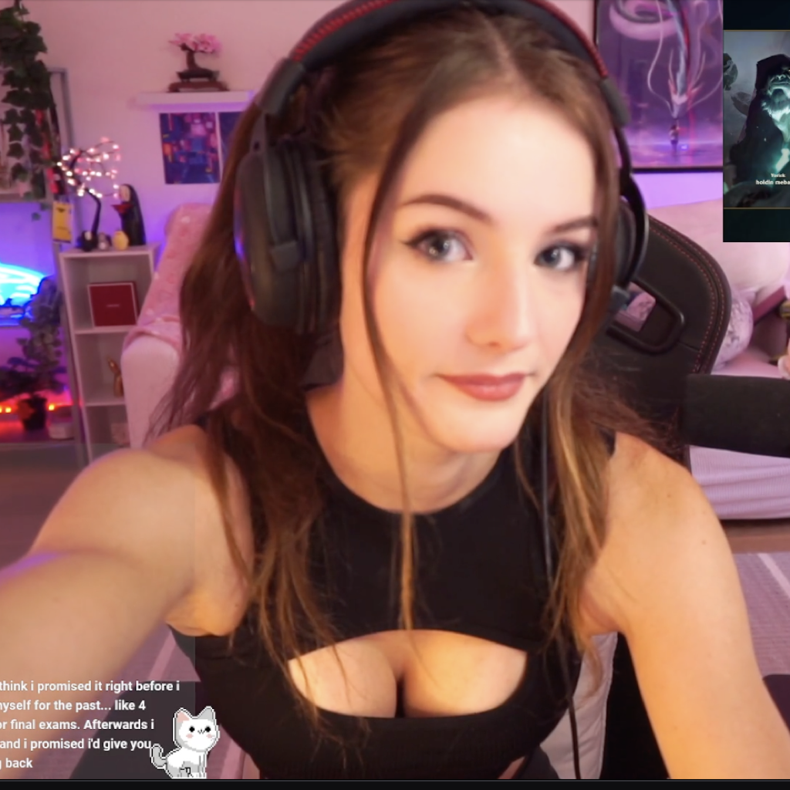

<p align="center">
  
</p>

<h1 align="center">Cortex</h1>

<p align="center">
  Voice-first note sorter for Obsidian. Record → transcribe → classify → route to your vault.<br/>
  Fully on-device. No cloud. No API keys.
</p>

<p align="center">
  
  
  
</p>

---

> **This project is a work in progress.** Core functionality works on-device but the app is not yet on the App Store. Expect rough edges, missing features, and breaking changes.

## What It Does

Cortex turns voice recordings into organized Obsidian notes. You talk, it listens, and your thoughts end up in the right `.md` files — no typing, no manual sorting.

**Pipeline:** Mic → WhisperKit transcription → Qwen2.5 LLM classification → Vault routing → Markdown write

Each recording can produce multiple items (notes, todos, reminders, events) routed to different files based on topic matching against your existing vault structure.

## Features

- **On-device transcription** — WhisperKit (OpenAI Whisper large-v3, quantized 626MB) running on Apple Neural Engine
- **On-device classification** — Qwen2.5-3B-Instruct via llama.cpp with GBNF grammar-constrained JSON output
- **Smart vault routing** — 3-stage pipeline: keyword pre-filter → LLM picks from candidates → deterministic validation
- **Multi-file routing** — One recording can create notes across multiple vault files with `[[wikilink]]` cross-references
- **EventKit integration** — Automatically creates iOS Reminders and Calendar events when time-bound items are detected
- **Background processing** — Recordings are queued and processed even when the app is backgrounded
- **Action Button support** — Configure iPhone 15 Pro Action Button to launch directly into recording via `cortex://record`
- **Zero cloud dependency** — Everything runs locally. No accounts, no API keys, no data leaves your device

## Architecture

```
┌─────────────┐     ┌──────────────┐     ┌─────────────┐     ┌─────────────┐
│  Record      │ ──▶ │  Transcribe  │ ──▶ │  Classify   │ ──▶ │  Route &    │
│  (AVAudio)   │     │  (WhisperKit)│     │  (Qwen2.5)  │     │  Write (.md)│
└─────────────┘     └──────────────┘     └─────────────┘     └─────────────┘
                                                                     │
                                                               ┌─────┴─────┐
                                                               │ EventKit  │
                                                               │ (optional)│
                                                               └───────────┘
```

| Component | Tech |
|-----------|------|
| Transcription | WhisperKit (large-v3 quantized, CoreML/ANE) |
| Classification | Qwen2.5-3B-Instruct (Q4_K_M, llama.cpp, GBNF grammar) |
| Storage | SwiftData (queue + items), iCloud Drive (vault .md files) |
| UI | SwiftUI, dark theme, 4-tab navigation |
| Background | BGProcessingTask + hybrid foreground processing |

## Requirements

- iPhone with A15 chip or later (tested on iPhone 15 Pro)
- iOS 18.0+
- Xcode 16.0+ with Swift 6
- An Obsidian vault folder (or any folder of `.md` files)

## Building

```bash
# 1. Clone
git clone https://github.com/monniiesh/Cortex.git
cd Cortex

# 2. Download the LLM model (not in git — too large)
# Place in Cortex/ directory
curl -L -o Cortex/qwen2.5-3b-instruct-q4_k_m.gguf \
  "https://huggingface.co/Qwen/Qwen2.5-3B-Instruct-GGUF/resolve/main/qwen2.5-3b-instruct-q4_k_m.gguf"

# 3. Generate Xcode project (requires xcodegen)
brew install xcodegen
xcodegen generate

# 4. Open and build
open Cortex.xcodeproj
# Build for physical device (not simulator — needs Metal + ANE)
```

> **Note:** The WhisperKit transcription model (~626MB) downloads automatically from HuggingFace on first use. First transcription takes ~85 seconds; subsequent runs use the cached model.

## Project Structure

```
Cortex/
├── CortexApp.swift              # Entry point, service wiring
├── AppState.swift               # Observable app state
├── Models/                      # SwiftData models + types
├── Services/
│   ├── AudioRecordingService    # AVAudioRecorder + metering
│   ├── TranscriptionService     # WhisperKit integration
│   ├── LLMService               # llama.cpp inference + GBNF grammar
│   ├── PromptBuilder            # System/user prompt construction
│   ├── ResponseParser           # 3-tier JSON parsing
│   ├── VaultPreFilter           # Keyword scoring for candidate selection
│   ├── VaultRouter              # Deterministic file matching
│   ├── VaultWriter              # NSFileCoordinator markdown I/O
│   ├── ProcessingPipeline       # Orchestrator (transcribe → classify → write)
│   ├── EventKitService          # Reminders + Calendar creation
│   └── ...
├── Views/
│   ├── ContentView              # Root (onboarding guard + tabs + overlays)
│   ├── HomeView                 # Folder grid
│   ├── CaptureView              # Recording interface
│   ├── SearchView               # Full-text search with type filters
│   ├── SettingsView             # App configuration
│   └── ...
└── project.yml                  # XcodeGen spec
```

## Current Status

This is an active development project. Here's what works and what doesn't:

**Working**
- [x] Voice recording with waveform visualization
- [x] On-device transcription (WhisperKit)
- [x] LLM classification with grammar-constrained JSON
- [x] Vault file routing (existing + new file creation)
- [x] EventKit integration (reminders + calendar events)
- [x] Background processing
- [x] 4-tab UI (Home, Capture, Search, Settings)
- [x] Onboarding flow
- [x] Action Button URL scheme

**Known Limitations**
- [ ] No App Store release yet
- [ ] First-time model download has no progress UI
- [ ] No editing of classified items after processing
- [ ] No manual re-classification or undo
- [ ] Search only covers SwiftData records, not raw vault content
- [ ] No iPad or Mac support

## License

This project is not yet licensed for distribution. All rights reserved.
